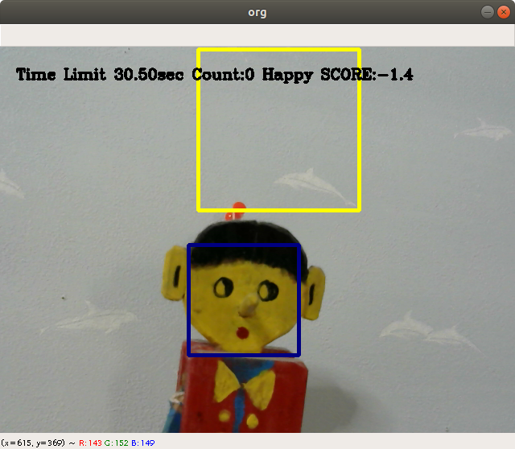

瞬間表情力テスト
==

## 概要
自分の顔の周りが青い矩形で囲まれます、黄色（Happy）かオレンジ（Angry）の矩形も表示されます。  
その矩形の枠の中に色に合わせた表情で顔を映してください。  
この映すスピードと表情力（何％の割合で表情を再現できているか）をスコア化します。  
CPUでもサクサク動くのでお手軽です。（CPUで動かす場合は下の注意を読んでから）


* Time Limit: 制限時間
* Count: 正解数
* Something: お題の表情(Happy or Angry)
* SCORE: スコア

## ルール
* 制限時間は1分間
* スコアが高ければ高いほど良い（瞬発表情力がある）
* 1人用
* カメラに向かって正面に顔を映さないと認識されないことがあるので正面に立ちましょう

## 使い方
### 使用環境
* Python3.6(EmoPyが3.6じゃないと動かない)
  
そして、以下のスクリプトをターミナルで実行します。
```bash
$ pip install EmoPy
$ pip uninstall scipy
$ pip install scipy==1.1.0
```

### 【重要】EmoPyのコードの変更  
予測値が返ってくるように少し改良させる。ファイルパスは環境によって異なるが、anacondaを使っている場合は下のパス通りのところにあるはず。
>"
/home/username/anaconda3/envs/deep36/lib/python3.6/site-packages/EmoPy/src/fermodel.py  
60行目  
        # self._print_prediction(prediction[0]) # past  
        memo = self._print_prediction(prediction[0])  # add  
        return memo  # add  
60行目をコメントアウトし、後ろの2行を追加。  
113行目に  
        return [str(dominant_emotion), normalized_prediction[self.emotion_map[emotion]] * 100]  
を追加。  
実行結果が返ってくるように改良した。"  

main.pyから引用  

### 【注意】CPUで動かす場合
本アプリケーションはCPUでの動作を確認しております（動作はGPUと変わらないくらい軽い）。  
CPUで使用する場合は、  
face_emotions.pyの9行目~15行目の以下のコードをコメントアウトしてから実行してください。
```face_emotion.py
config = tf.ConfigProto(
    gpu_options=tf.GPUOptions(
        visible_device_list="0",  # specify GPU number
        allow_growth=True
    )
)
set_session(tf.Session(config=config))
```
また、複数GPUを使用する場合などはこのvisible_device_listの値を変更するなどしてください。

### コマンドラインで動かす場合
main.pyの41行目
```main.py
self.cascade_file = "haarcascade_frontalface_alt.xml"
```
コマンドラインで実行する場合はこのパスを絶対パスにしてください。  
PyCharm等のIDEで動かすのであればこの相対パスのままで構いません。  
